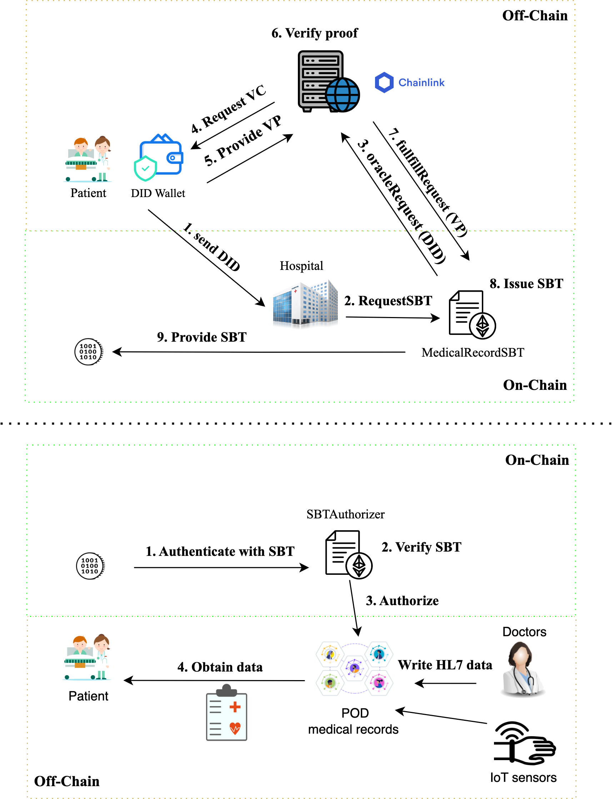

# Description
This repository contains the code for my thesis project titled "Decentralized Authentication with Soulbound Tokens: Designing a Blockchain System for Secure Healthcare Data Management."

## Abstract 
This thesis explores decentralized authentication within the emerging Web 3.0 context, proposing an innovative solution for managing digital identities using Blockchain and Self-Sovereign Identity (SSI) technologies. Key topics include the fundamentals of Blockchain, smart contract applications, the anatomy of the SSI model, and the critical role of Oracles. A detailed analysis of the proposed application highlights the technical requirements, development environment, and system architecture. The implementation process is described step-by-step, with a particular focus on system deployment and testing. The thesis concludes with a discussion of the achieved results and potential future directions for further developments in the field.

## System architecture

